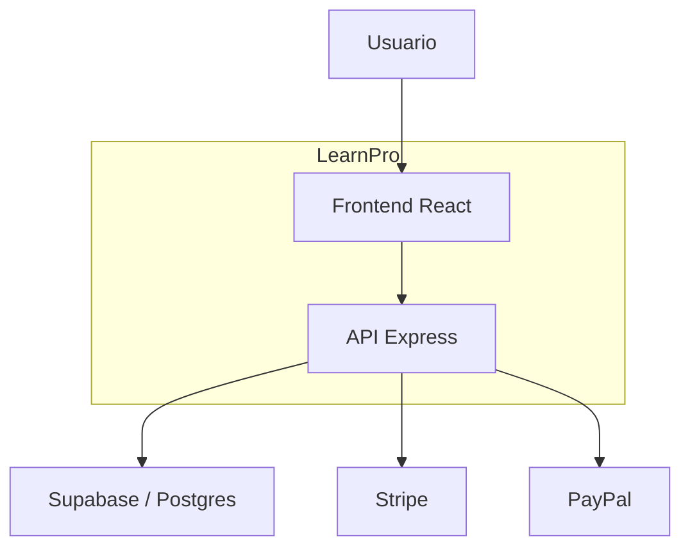
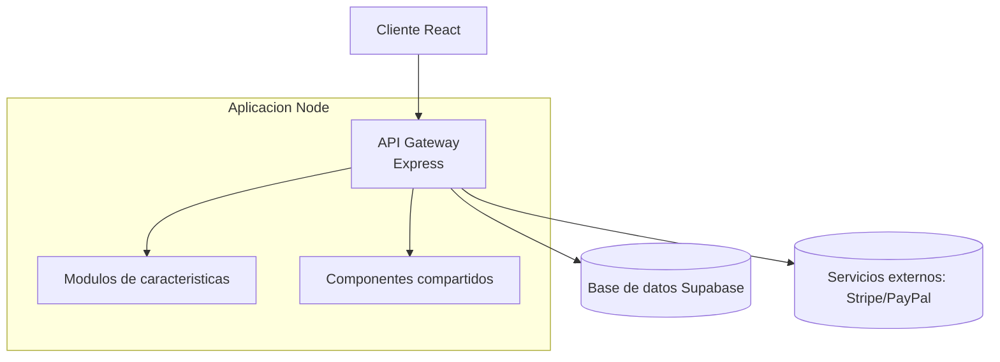

# Modelo C4 de LearnPro

A continuacion se presenta una vision simplificada del sistema siguiendo la metodologia C4 mediante diagramas Mermaid.

## Diagrama de contexto

## Diagrama de contenedores

Los modulos incluyen autenticacion, cursos, pagos y notificaciones. Cada modulo expone rutas REST que son montadas por el API gateway.

Para mas detalle de componentes internos se recomienda revisar el codigo fuente de cada modulo.
